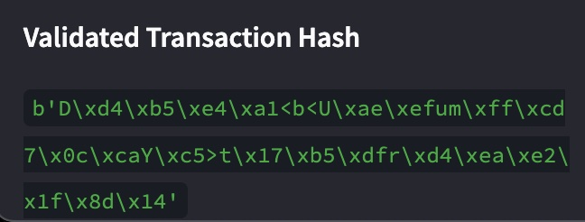
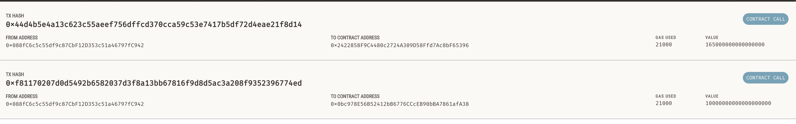

# Unit-19-Blockchain-Wallets-Homework

This homework assignment creates a `Streamlit` app called Fintech Finder, which allows the user to look for a Fintech professionals, their hourly rates,  hire them and pay them through `Ethereum` blockchain network.

## Streamlit App

The python file [fintech_finder.py](code/fintech_finder.py) creates a `StreamLit` application that :  
- Generate a new Ethereum account instance by using the mnemonic seed phrase
- Fetch and display the account balance associated with the Ethereum account
address.
- Calculate the total value of an Ethereum transaction i.e. the total wage to be paid to the Fintech professional based on their hourly rate and number of hours of work required.
- Digitally sign a transaction that pays a Fintech Finder candidate, and send
this transaction to the `Ganache` blockchain.
- Displays the the transaction hash code associated with the validated blockchain transaction.

## Crypto Wallet Functions

The `Streamlit` app uses the [crypto_wallet.py](code/crypto_wallet.py) that provides the `Ethereum` wallet and transaction functions such as:
- Generate the account based on the `Mnemonic` seed phrase.
- Get balance in ether from the wallet
- Send transaction to the block chain with a validated transaction hash.

The above is setup as an instance of the `Record` class and then added to the `Block` and once the `Proof Of Work` is achieved, the block is added to the PyChain Ledger.

## Screenshots
### Streamlit Transaction

The original balance in the account is `90 ether`.  The transaction of `0.165 ether` is sent to candidate Ash who has a hourly rate of `0.33 ether` for 0.5 hours of work.  

### Tramsaction Hash
A validated transaction hash appears on successful transaction.

### Ganache Account
The account balance has been been updated to `89.83 ether` after sending `0.165 ether`.

### Ganache Transactions
The Ganache transaction displaying the transaction of `0.165 ether` to the candidate's account.

### App in Action
